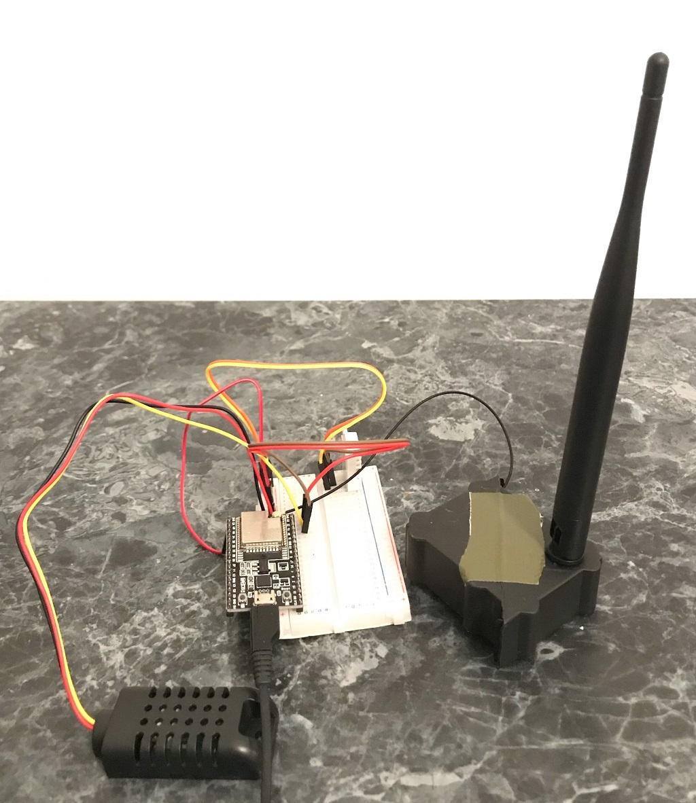

# esp32_dht22
DHT22 -> ESP32 -> https: IoT Project



## ESP 32 Getting Started

https://docs.espressif.com/projects/esp-idf/en/stable/esp32/get-started/index.html

## Board documentation

https://download.kamami.pl/p579575-esp32_devkitc_v4-sch-20180607a.pdf

## Chip's Datasheet

https://download.kamami.pl/p579575-esp32-wroom-32d_esp32-wroom-32u_datasheet_en.pdf

## Sensor's Documentation

https://dl.btc.pl/kamami_wa/dht22_ds.pdf

## Build instructions (Linux)

```
# unless already done: . $HOME/esp/esp-idf/export.sh
idf.py set-target esp32
idf.py menuconfig
idf.py build
idf.py -p /dev/ttyUSB0 flash monitor
# ... then
idf.py -p /dev/ttyUSB0 monitor
```
